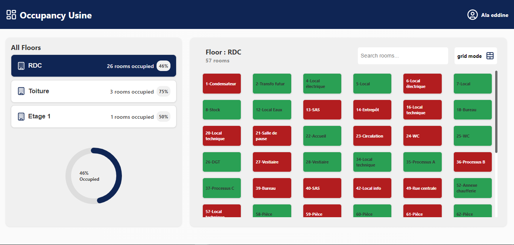
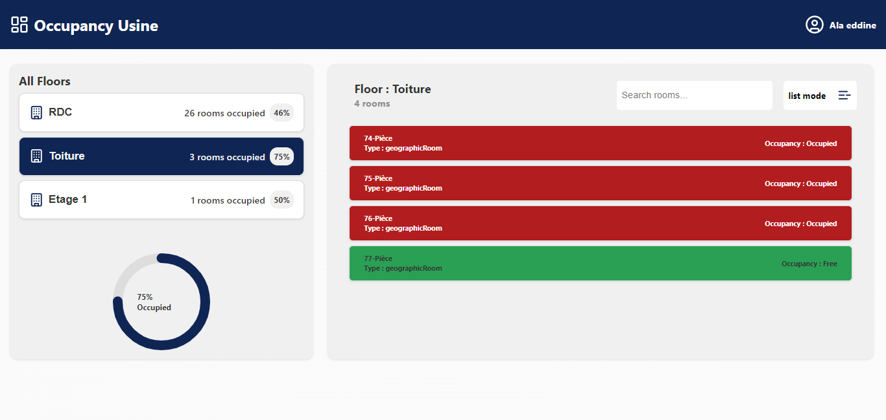

# Occupancy Usine

Occupancy Usine is a technical test project created using ReactJS and TypeScript for the SpinalCom evaluation.

## Mockups





## Video Demonstration

A video demonstration of the Occupancy Usine application is available at [Google Drive](https://drive.google.com/file/d/1YFBWYiawjp0nuD8YzZcNghGs0ne4Tvrn/view?usp=sharing).

## Installation

### Prerequisites:

1. **Node.js:** [Download and Install Node.js](https://nodejs.org/)

### Getting Started:

```bash
# Clone the repository
git clone https://github.com/Alaeddine-Nasri/UsineOccupation.git

# Navigate to the project directory
cd Occupancy-Usine

# Install dependencies
npm install

#Run the project
npm run
```
# UsineOccupation
